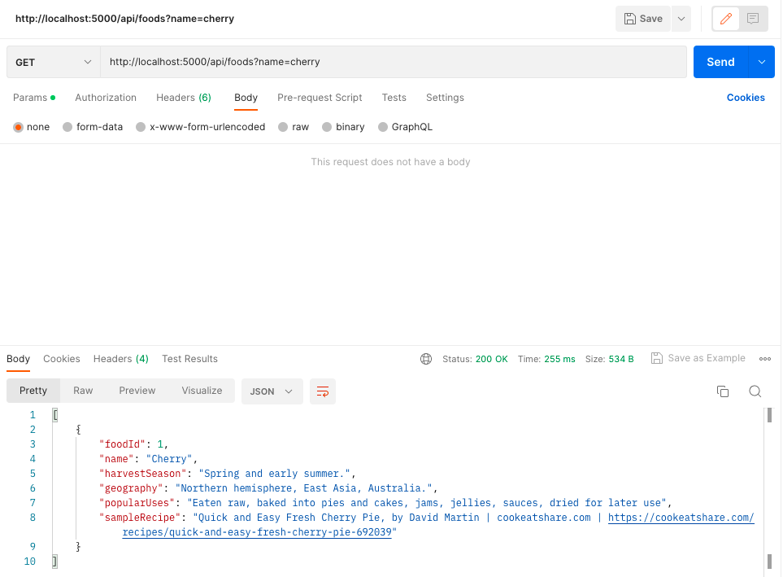
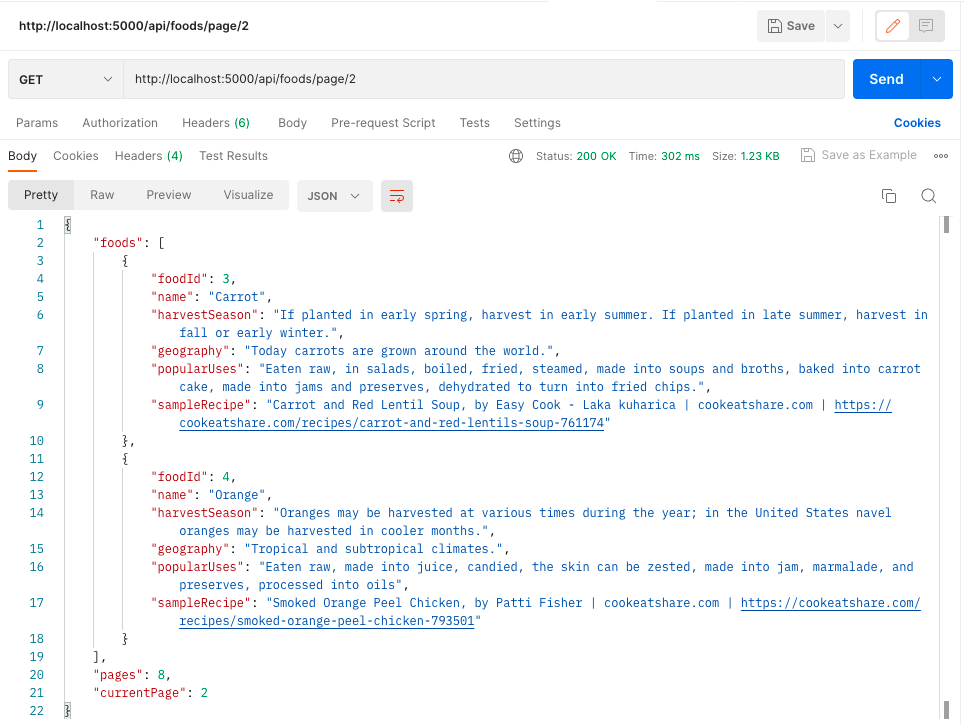
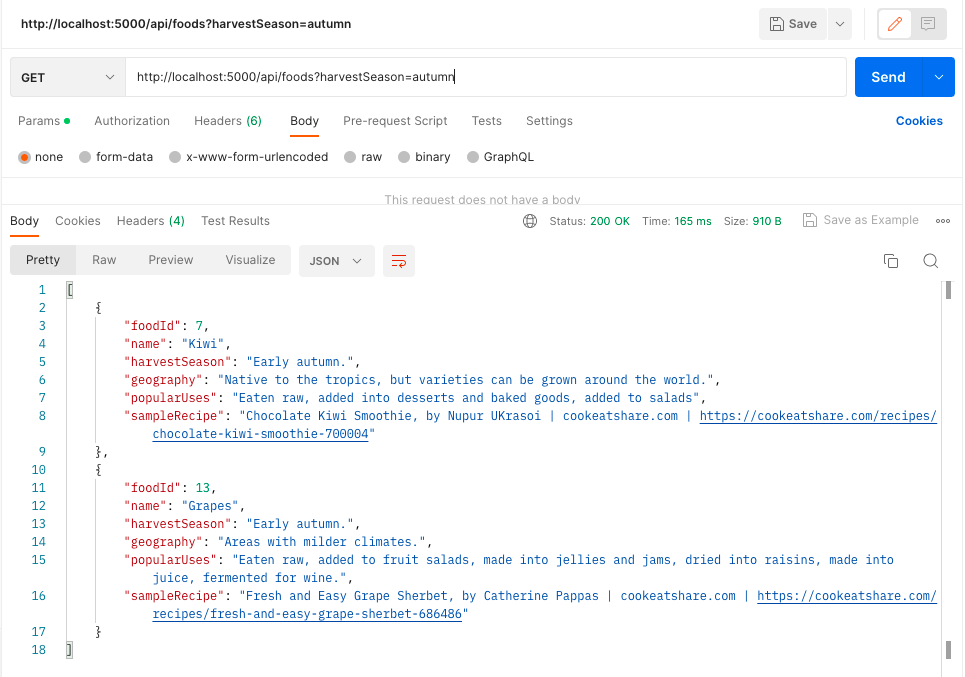
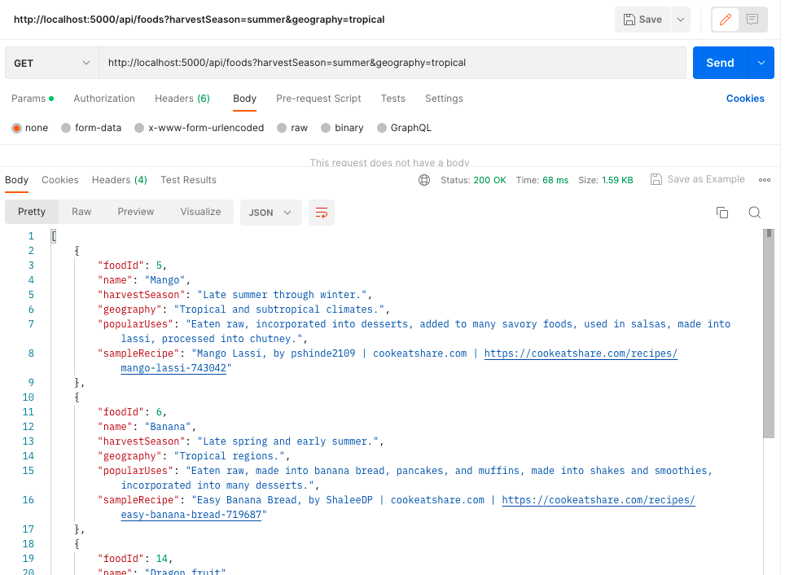
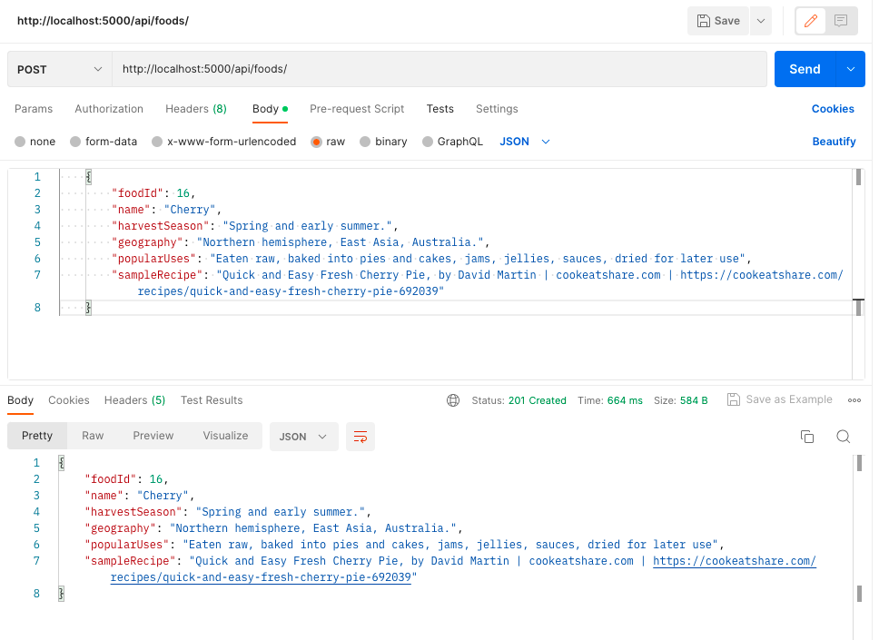

## 🍒 Seasonal Food API

#### By Sarah Andyshak

### Description

This API was created as the backend for the React application [_Is it in Season?_](https://github.com/SarahAndyshak/seasonal-foods). The API provides information on when fruits and vegetables are in season, general information about growing climates, and popular uses.

#### [Technologies Used](#technologies-used)
#### [How To Run This Project](#how-to-run-this-project)
#### [Available Endpoints](#available-endpoints)
#### [Optional Query String Parameters for GET Request](#optional-query-string-parameters-for-get-request)
#### [Known Bugs](#known-bugs)
#### [License](#license)

## Technologies Used

* C#
* .NET
* ASP.Net
* Entity Framework

## How To Run This Project

### Install Tools

Install the tools that are introduced in [this series of lessons on LearnHowToProgram.com](https://www.learnhowtoprogram.com/c-and-net/getting-started-with-c).

If you have not already, install the `dotnet-ef` tool by running the following command in your terminal:

```
dotnet tool install --global dotnet-ef --version 6.0.0
```

### Set Up and Run Project

1. Clone this repo.
2. Open the terminal and navigate to this project's production directory called "SeasonalFood".
3. Within the production directory "SeasonalFood", create two new files: `appsettings.json` and `appsettings.Development.json`.
4. Within `appsettings.json`, put in the following code. Make sure to replace the `database` ("YOUR-DATABASE-NAME-HERE"), `uid` ("YOUR-USER-NAME-HERE"), and `pwd` ("YOUR-PASSWORD-HERE") values in the MySQL database connection string with your own username and password for MySQL.

```json
{
  "Logging": {
    "LogLevel": {
      "Default": "Information",
      "Microsoft.AspNetCore": "Warning"
    }
  },
  "AllowedHosts": "*",
  "ConnectionStrings": {
    "DefaultConnection": "Server=localhost;Port=3306;database=YOUR-DATABASE-NAME-HERE;uid=YOUR-USER-NAME-HERE;pwd=YOUR-PASSWORD-HERE;"
  }
}
```

5. Within `appsettings.Development.json`, add the following code:

```json
{
  "Logging": {
    "LogLevel": {
      "Default": "Information",
      "Microsoft": "Trace",
      "Microsoft.AspNetCore": "Information",
      "Microsoft.Hosting.Lifetime": "Information"
    }
  }
}
```

6. Create the database using the migrations in the Seasonal Food API project. Open your shell (e.g., Terminal or GitBash), navigate to the production directory "SeasonalFood", and run `dotnet ef database update`. You may need to run this command for each of the branches in this repo if multiple branches have been created. 
    - To optionally create a migration, run the command `dotnet ef migrations add MigrationName` where `MigrationName` is your custom name for the migration in UpperCamelCase. To learn more about migrations, visit the LHTP lesson [Code First Development and Migrations](https://www.learnhowtoprogram.com/c-and-net-part-time/many-to-many-relationships/code-first-development-and-migrations).
7. Enable CORS by running `dotnet add package Microsoft.AspNet.WebApi.Cors --version 5.2.9` and adding the following code to Program.cs

```
var devCorsPolicy = "devCorsPolicy";
builder.Services.AddCors(options => options.AddPolicy(devCorsPolicy, builder =>
    {
    builder
        .AllowAnyOrigin()
        .AllowAnyMethod()
        .AllowAnyHeader();
    }));
  ...
  app.UseCors(devCorsPolicy);
  ```

8. Within the production directory "SeasonalFood", run `dotnet watch run --launch-profile "SeasonalFood-Production"` in the command line to start the project in production mode with a watcher. 
9. To optionally further build out this project in development mode, start the project with `dotnet watch run` in the production directory "SeasonalFood".
10. Use your program of choice to make API calls. In your API calls, use the domain _http://localhost:5000_. Keep reading to learn about all of the available endpoints.

## Testing the API Endpoints

You are welcome to test this API via [Postman](https://www.postman.com/) or [curl](https://curl.se/).

### Available Endpoints

```
GET http://localhost:5000/api/foods/
GET http://localhost:5000/api/foods/{id}
GET http://localhost:5000/api/foods/page/{page}
POST http://localhost:5000/api/foods/
PUT http://localhost:5000/api/foods/{id}
DELETE http://localhost:5000/api/foods/{id}
```

Note: `{id}` is a variable and it should be replaced with the id number of the food you want to GET, PUT, or DELETE. For GET .../page/{page}, {page} indicates the page number you wish to view. 

### Optional Query String Parameters for GET Request

GET requests to `http://localhost:5000/api/foods/` can optionally include query strings to filter or search foods. For example:

| Parameter   | Type        |  Required    | Description |
| ----------- | ----------- | -----------  | ----------- |
| name        | String      | not required | Returns foods with a matching name value |
| harvestSeason  | String      | not required | Returns foods with a matching classification value |


The following query will return all foods with the name "cherry":

```
GET http://localhost:5000/api/foods?name=cherry
```


The following query will return the second page, with 2 foods on it:

```
GET http://localhost:5000/api/foods/page/2
```


To find a food harvested in the autumn:

```
GET http://localhost:5000/api/foods&harvestSeason=autumn
```


You can include multiple query strings by separating them with an `&`:

```
GET http://localhost:5000/api/foods?harvestSeason=summer&geography=tropical
```


### Additional Requirements for POST Request

When making a POST request to `http://localhost:5000/api/foods/`, you need to include a **body**. Here's an example body in JSON:

```json
{
  "foodId": 5,
  "name": "Mango",
  "harvestSeason": "Late summer through winter.",
  "geography": "Tropical and subtropical climates.",
  "popularUses": "Eaten raw, incorporated into desserts, added to many savory foods, used in salsas, made into lassi, processed into chutney.",
  "sampleRecipe": "Mango Lassi, by pshinde2109 | cookeatshare.com | https://cookeatshare.com/recipes/mango-lassi-743042"
}
```

### Additional Requirements for PUT Request

When making a PUT request to `http://localhost:5000/api/foods/{id}`, you need to include a **body** that includes the parks's `parkId` property. Here's an example body in JSON:

```json
{
  "foodId": 5,
  "name": "Mango",
  "harvestSeason": "Late summer through winter.",
  "geography": "Tropical and subtropical climates.",
  "popularUses": "Eaten raw, incorporated into desserts, added to many savory foods, used in salsas, made into lassi, processed into chutney.",
  "sampleRecipe": "Mango Lassi, by pshinde2109 | cookeatshare.com | https://cookeatshare.com/recipes/mango-lassi-743042"
}
```

And here's the PUT request we would send the previous body to:

```
http://localhost:5000/api/foods/5
```


Notice that the value of `foodId` needs to match the id number in the URL. In this example, they are both 5.

### Note about pagination
This API provides the ability to enable responsive pagination in projects. Responsive pagination works fine when the API is tested with Postman. However, I have not implemented this in the [_Is it in Season?_](https://github.com/SarahAndyshak/seasonal-foods) project.

## Known Bugs

* As 12 May 20223, none found.

## License
Enjoy the API! If you have questions or suggestions for fixing the code, please contact me!

[MIT](https://github.com/git/git-scm.com/blob/main/MIT-LICENSE.txt)

Copyright (c) 2023 Sarah Andyshak